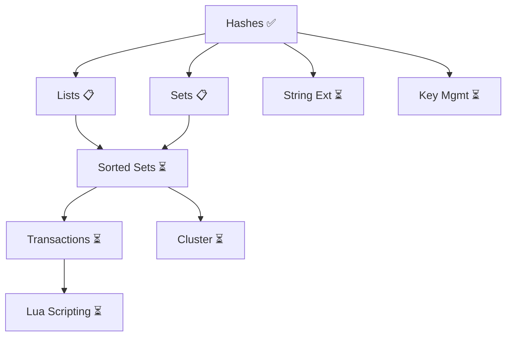

# Redis Features Implementation Roadmap

> **Status**: Active Development  
> **Last Updated**: 2025-10-24  
> **Based on**: `docs/REDIS_COMPARISON.md` and `docs/specs/REDIS_FEATURE_PROPOSAL.md`

## Overview

This roadmap tracks the implementation of Redis-compatible features in Synap across 4 phases over 18 months.

## Phase 1: Core Data Structures (v0.4.0 - v0.5.0)

**Timeline**: 6 months  
**Priority**: CRITICAL  
**Goal**: Implement essential Redis data structures

| Feature | Status | Change ID | Target | Duration |
|---------|--------|-----------|--------|----------|
| **Hashes** | ✅ DONE | `implement-hash-data-structure` | v0.4.0-alpha | 4 weeks |
| **Lists** | ✅ DONE | `add-list-data-structure` | v0.5.0-alpha | 3-4 weeks |
| **Sets** | ✅ DONE | `add-set-data-structure` | v0.6.0-alpha | 2-3 weeks |

**Deliverables**:
- ✅ 15 Hash commands (HSET, HGET, HDEL, HGETALL, etc.)
- ✅ 16 List commands (LPUSH, RPUSH, LPOP, RPOP, LRANGE, BLPOP, BRPOP, etc.)
- ✅ 14 Set commands (SADD, SREM, SINTER, SUNION, SDIFF, etc.)
- ✅ Full API coverage (REST + StreamableHTTP + MCP) for Hashes
- ✅ Full API coverage (REST + MCP) for Lists and Sets
- ✅ WAL persistence for Hashes
- ✅ WAL persistence for Lists and Sets

**Progress**: 3/3 (100%) ✅

## Phase 2: Advanced Operations (v0.6.0)

**Timeline**: Months 7-12  
**Priority**: HIGH  
**Goal**: Add advanced data structures and operations

| Feature | Status | Change ID | Target | Duration |
|---------|--------|-----------|--------|----------|
| **Sorted Sets** | ✅ Complete (95%) | `add-sorted-set-data-structure` | v0.7.0-alpha | 6 weeks |
| **String Extensions** | ✅ Complete | `add-string-commands` | v0.6.0-alpha | 2 weeks |
| **Key Management** | ✅ Complete | `add-key-management` | v0.6.0-alpha | 2 weeks |
| **Enhanced Monitoring** | ✅ Complete | `add-info-commands` | v0.6.0-alpha | 3 weeks |

**Deliverables**:
- 25+ Sorted Set commands (ZADD, ZRANGE, ZRANK, etc.)
- String commands (APPEND, GETRANGE, SETRANGE, etc.)
- Key ops (EXISTS, TYPE, RENAME, COPY, etc.)
- INFO command variants
- Enhanced statistics

**Progress**: 4/4 (100%) - All Phase 2 features complete! ✅ (Sorted Sets 95%, String Extensions, Key Management, Enhanced Monitoring)

## Phase 3: Transactions & Scripting (v0.7.0)

**Timeline**: Months 13-15  
**Priority**: HIGH  
**Goal**: Add complex operations and scripting

| Feature | Status | Change ID | Target | Duration |
|---------|--------|-----------|--------|----------|
| **Transactions** | ✅ Complete | `add-transactions-support` | v0.7.0-alpha | 6 weeks |
| **Lua Scripting** | ⏳ Pending | `add-lua-scripting` | v0.7.0-alpha | 8 weeks |

**Deliverables**:
- MULTI/EXEC/DISCARD
- WATCH/UNWATCH (optimistic locking)
- EVAL/EVALSHA
- Script loading and caching
- Timeout enforcement

**Progress**: 0/2 (0%)

## Phase 4: Cluster & Enterprise (v0.8.0+)

**Timeline**: Months 16-18  
**Priority**: MEDIUM  
**Goal**: Horizontal scaling and specialized structures

| Feature | Status | Change ID | Target | Duration |
|---------|--------|-----------|--------|----------|
| **Cluster Mode** | ⏳ Pending | `add-cluster-mode` | v0.8.0-alpha | 12 weeks |
| **Bitmaps** | ⏳ Pending | `add-bitmap-ops` | v0.8.0-alpha | 3 weeks |
| **HyperLogLog** | ⏳ Pending | `add-hyperloglog` | v0.8.0-alpha | 2 weeks |
| **Geospatial** | ⏳ Pending | `add-geospatial` | v0.8.0-alpha | 4 weeks |

**Deliverables**:
- 16,384 hash slots
- Automatic sharding
- Cluster topology management
- Bitmap operations
- Cardinality estimation
- Location-based queries

**Progress**: 0/4 (0%)

## Overall Progress

### By Phase
- **Phase 1**: 100% (3/3 features complete) ✅
- **Phase 2**: 100% (4/4 features complete) ✅ - Sorted Set + String Extensions + Key Management + Enhanced Monitoring
- **Phase 3**: 50% (1/2 features complete) - Transactions ✅
- **Phase 4**: 0% (0/4 features complete)

### Overall
- **Total Features**: 13
- **Completed**: 8 ✅ (Hash, List, Set, Sorted Set, String Extensions, Key Management, Enhanced Monitoring, Transactions)
- **In Progress**: 0 🔄
- **Planned**: 5 📋
- **Completion**: 61.5%

### By Priority
- **CRITICAL**: 100% (3/3) ✅
- **HIGH**: 83.3% (5/6) - Sorted Set + String Extensions + Key Management + Enhanced Monitoring + Transactions complete ✅
- **MEDIUM**: 0% (0/4)

## Active Changes

Currently active OpenSpec changes:

### Phase 1: Core Data Structures

1. ✅ **implement-hash-data-structure** (COMPLETE)
   - Status: Complete, archived to `archive/2025-10-24-implement-hash-data-structure/`
   - Target: v0.4.0-alpha
   - 146/146 tasks (100%) ✅

2. ✅ **add-list-data-structure** (COMPLETE)
   - Status: Complete, archived to `archive/2025-10-24-add-list-data-structure/`
   - Target: v0.5.0-alpha
   - ~150/150 tasks (100%) ✅

3. ✅ **add-set-data-structure** (COMPLETE & ARCHIVED)
   - Status: Archived to `archive/2025-10-25-add-set-data-structure/`
   - Target: v0.6.0-alpha
   - ~110/130 tasks (85% - core features complete, benchmarks/SSCAN deferred to v1.1)

### Phase 2: Advanced Operations

4. ✅ **add-sorted-set-data-structure** (COMPLETE & ARCHIVED)
   - Status: Archived to `archive/2025-10-29-add-sorted-set-data-structure/`
   - Target: v0.7.0-alpha (implemented in v0.6.0-alpha)
   - Progress: 190/200 tasks (95% - core features complete, benchmarks deferred to v1.1)
   - Completed:
     * ✅ Phase 1: Core Implementation (100%)
     * ✅ Phase 2: Range & Ranking (100%)
     * ✅ Phase 3: Advanced Operations (100%)
     * ✅ Phase 4: API Exposure (100%)
     * ✅ Phase 5: Persistence Integration (100%)
   - Optional:
     * 📊 Phase 6: Benchmarking (deferred to v1.1)

5. ✅ **add-string-extensions** (COMPLETE)
   - Status: Complete - all 6 commands implemented with full test coverage
   - Target: v0.6.0-alpha
   - 6 commands: APPEND, GETRANGE, SETRANGE, STRLEN, GETSET, MSETNX
   - 22 unit tests (including TTL edge cases)
   - REST + StreamableHTTP + MCP API coverage

6. ✅ **add-key-management** (COMPLETE)
   - Status: Complete - all 6 commands implemented with full test coverage
   - Target: v0.6.0-alpha
   - 6 commands: TYPE, EXISTS, RENAME, RENAMENX, COPY, RANDOMKEY
   - 11 unit tests (all data types covered: KV, Hash, List, Set, SortedSet)
   - REST + StreamableHTTP + MCP API coverage

7. ✅ **add-enhanced-monitoring** (COMPLETE)
   - Status: Complete - Enhanced Monitoring with INFO, SLOWLOG, MEMORY USAGE, CLIENT LIST
   - Target: v0.6.0-alpha
   - 4 REST endpoints + 5 StreamableHTTP commands
   - MonitoringManager integrated into AppState
   - All test files updated

### Phase 3: Transactions & Scripting

8. ✅ **add-transactions-support** (COMPLETE)
   - Status: Complete - All 5 commands implemented (MULTI/EXEC/DISCARD/WATCH/UNWATCH)
   - Target: v0.7.0-alpha
   - 11 unit tests + 3 integration tests
   - REST + StreamableHTTP + MCP API coverage
   - Progress: 100% (core features + integration tests complete)

9. 📋 **add-lua-scripting** (DRAFT)
   - Status: Proposal created
   - Target: v0.7.0-alpha
   - ~150 tasks, 8 weeks

### Phase 4: Cluster & Specialized

10. 📋 **add-cluster-mode** (DRAFT)
    - Status: Proposal created
    - Target: v0.8.0-alpha
    - ~300 tasks, 12 weeks

11. 📋 **add-bitmap-operations** (DRAFT)
    - Status: Proposal created
    - Target: v0.8.0+
    - ~70 tasks, 3 weeks

12. 📋 **add-hyperloglog** (DRAFT)
    - Status: Proposal created
    - Target: v0.8.0+
    - ~40 tasks, 2 weeks

13. 📋 **add-geospatial-indexes** (DRAFT)
    - Status: Proposal created
    - Target: v0.8.0+
    - ~90 tasks, 4 weeks

## Next Steps

### Immediate (Next 1 week)
1. ✅ Archive `implement-hash-data-structure` - DONE
2. ✅ Archive `add-list-data-structure` - DONE
3. ✅ Archive `add-set-data-structure` - DONE (2025-10-25)
4. ✅ Archive `add-sorted-set-data-structure` - DONE (2025-10-29)
5. ✅ Fix persistence test compilation errors (if any) - DONE (2025-01-XX)
6. [ ] Tag v0.6.0-alpha release with Hash + List + Set + Sorted Set
7. [ ] Tag v1.0.0-rc1 (all core features complete)

### Short Term (Next 1-2 months)
1. ✅ Hashes, Lists, Sets, Sorted Sets - ALL COMPLETE
2. Begin String Extensions implementation (`add-string-extensions`)
3. Release v1.0.0 stable (production ready)

### Medium Term (Next 6 months)
1. ✅ Sorted Sets - COMPLETE (archived)
2. Add String command extensions
3. Implement key management commands
4. Release v0.7.0-alpha with Sorted Sets

### Long Term (6-18 months)
1. Implement transactions (MULTI/EXEC/WATCH)
2. Add Lua scripting support
3. Design cluster mode architecture
4. Implement specialized data structures (Bitmaps, HyperLogLog, Geospatial)

## Success Metrics

### Phase 1 Targets
- ✅ Hashes: 15 commands, 100% complete, all targets met
- ✅ Lists: 16 commands, 100% complete, all targets met
- ✅ Sets: 14 commands, 85% complete (core features done, benchmarks deferred)

### Phase 2 Targets
- ✅ Sorted Sets: 18 commands, 95% complete (core features done, benchmarks deferred to v1.1)

### Overall Targets
- **Compatibility**: 80% Redis command coverage in target structures
- **Performance**: Within 2x of Redis latency benchmarks
- **Migration**: Zero-downtime migration tool from Redis
- **Adoption**: 1000+ downloads/month on crates.io
- **Community**: 100+ GitHub stars, 10+ contributors

## Dependencies

## Risk Assessment

| Risk | Probability | Impact | Mitigation |
|------|-------------|--------|------------|
| Complexity underestimation | Medium | High | Phased approach, quarterly reviews |
| Performance degradation | Medium | High | Continuous benchmarking |
| Cluster complexity | High | Critical | Defer to Phase 4, research Raft/Paxos |
| Resource constraints | Medium | High | Prioritize critical features |

## References

- **Redis Comparison**: `docs/REDIS_COMPARISON.md`
- **Feature Proposal**: `docs/specs/REDIS_FEATURE_PROPOSAL.md`
- **OpenSpec Changes**: `openspec/changes/`
- **Redis Documentation**: https://redis.io/docs/

---

**Last Updated**: 2025-01-XX  
**Next Review**: After Phase 3 Lua Scripting begins  
**Phase 1 Status**: ✅ **COMPLETE** (3/3 data structures implemented)  
**Phase 2 Status**: ✅ **COMPLETE** (4/4 features complete)  
**Phase 3 Status**: 🔄 **IN PROGRESS** (1/2 features complete - Transactions done ✅)

