# Redis Features Implementation Roadmap

> **Status**: Active Development  
> **Last Updated**: 2025-10-24  
> **Based on**: `docs/REDIS_COMPARISON.md` and `docs/specs/REDIS_FEATURE_PROPOSAL.md`

## Overview

This roadmap tracks the implementation of Redis-compatible features in Synap across 4 phases over 18 months.

## Phase 1: Core Data Structures (v0.4.0 - v0.5.0)

**Timeline**: 6 months  
**Priority**: CRITICAL  
**Goal**: Implement essential Redis data structures

| Feature | Status | Change ID | Target | Duration |
|---------|--------|-----------|--------|----------|
| **Hashes** | ✅ DONE | `implement-hash-data-structure` | v0.4.0-alpha | 4 weeks |
| **Lists** | 📋 Planned | `add-list-data-structure` | v0.5.0-alpha | 3-4 weeks |
| **Sets** | 📋 Planned | `add-set-data-structure` | v0.5.0-alpha | 2-3 weeks |

**Deliverables**:
- ✅ 15 Hash commands (HSET, HGET, HDEL, HGETALL, etc.)
- 📋 16 List commands (LPUSH, RPUSH, LPOP, RPOP, LRANGE, etc.)
- 📋 15 Set commands (SADD, SREM, SINTER, SUNION, etc.)
- ✅ Full API coverage (REST + StreamableHTTP + MCP) for Hashes
- 📋 Full API coverage for Lists and Sets
- ✅ WAL persistence for Hashes
- 📋 WAL persistence for Lists and Sets

**Progress**: 1/3 (33%)

## Phase 2: Advanced Operations (v0.6.0)

**Timeline**: Months 7-12  
**Priority**: HIGH  
**Goal**: Add advanced data structures and operations

| Feature | Status | Change ID | Target | Duration |
|---------|--------|-----------|--------|----------|
| **Sorted Sets** | ⏳ Pending | `add-sorted-set-data-structure` | v0.6.0-alpha | 6 weeks |
| **String Extensions** | ⏳ Pending | `add-string-commands` | v0.6.0-alpha | 2 weeks |
| **Key Management** | ⏳ Pending | `add-key-management` | v0.6.0-alpha | 2 weeks |
| **Enhanced Monitoring** | ⏳ Pending | `add-info-commands` | v0.6.0-alpha | 3 weeks |

**Deliverables**:
- 25+ Sorted Set commands (ZADD, ZRANGE, ZRANK, etc.)
- String commands (APPEND, GETRANGE, SETRANGE, etc.)
- Key ops (EXISTS, TYPE, RENAME, COPY, etc.)
- INFO command variants
- Enhanced statistics

**Progress**: 0/4 (0%)

## Phase 3: Transactions & Scripting (v0.7.0)

**Timeline**: Months 13-15  
**Priority**: HIGH  
**Goal**: Add complex operations and scripting

| Feature | Status | Change ID | Target | Duration |
|---------|--------|-----------|--------|----------|
| **Transactions** | ⏳ Pending | `add-transactions-support` | v0.7.0-alpha | 6 weeks |
| **Lua Scripting** | ⏳ Pending | `add-lua-scripting` | v0.7.0-alpha | 8 weeks |

**Deliverables**:
- MULTI/EXEC/DISCARD
- WATCH/UNWATCH (optimistic locking)
- EVAL/EVALSHA
- Script loading and caching
- Timeout enforcement

**Progress**: 0/2 (0%)

## Phase 4: Cluster & Enterprise (v0.8.0+)

**Timeline**: Months 16-18  
**Priority**: MEDIUM  
**Goal**: Horizontal scaling and specialized structures

| Feature | Status | Change ID | Target | Duration |
|---------|--------|-----------|--------|----------|
| **Cluster Mode** | ⏳ Pending | `add-cluster-mode` | v0.8.0-alpha | 12 weeks |
| **Bitmaps** | ⏳ Pending | `add-bitmap-ops` | v0.8.0-alpha | 3 weeks |
| **HyperLogLog** | ⏳ Pending | `add-hyperloglog` | v0.8.0-alpha | 2 weeks |
| **Geospatial** | ⏳ Pending | `add-geospatial` | v0.8.0-alpha | 4 weeks |

**Deliverables**:
- 16,384 hash slots
- Automatic sharding
- Cluster topology management
- Bitmap operations
- Cardinality estimation
- Location-based queries

**Progress**: 0/4 (0%)

## Overall Progress

### By Phase
- **Phase 1**: 33% (1/3 features complete)
- **Phase 2**: 0% (0/4 features complete)
- **Phase 3**: 0% (0/2 features complete)
- **Phase 4**: 0% (0/4 features complete)

### Overall
- **Total Features**: 13
- **Completed**: 1 ✅
- **In Progress**: 0 🔄
- **Planned**: 12 📋
- **Completion**: 7.7%

### By Priority
- **CRITICAL**: 33% (1/3)
- **HIGH**: 0% (0/6)
- **MEDIUM**: 0% (0/4)

## Active Changes

Currently active OpenSpec changes:

1. ✅ **implement-hash-data-structure** (MERGED)
   - Status: Complete, ready for archival
   - Target: v0.4.0-alpha
   - 145/146 tasks (99.3%)

2. 📋 **add-list-data-structure** (DRAFT)
   - Status: Proposal created
   - Target: v0.5.0-alpha
   - 0/150 tasks (0%)

3. 📋 **add-set-data-structure** (DRAFT)
   - Status: Proposal created
   - Target: v0.5.0-alpha
   - 0/130 tasks (0%)

## Next Steps

### Immediate (Next 2 weeks)
1. Archive `implement-hash-data-structure` to `changes/archive/2025-10-24-implement-hash-data-structure/`
2. Tag v0.4.0-alpha release
3. Begin implementation of Lists (`add-list-data-structure`)

### Short Term (Next 1-2 months)
1. Complete Lists implementation
2. Complete Sets implementation
3. Release v0.5.0-alpha with Hashes + Lists + Sets

### Medium Term (Next 6 months)
1. Begin Sorted Sets implementation
2. Add String command extensions
3. Implement key management commands
4. Release v0.6.0-alpha

### Long Term (6-18 months)
1. Implement transactions (MULTI/EXEC/WATCH)
2. Add Lua scripting support
3. Design cluster mode architecture
4. Implement specialized data structures (Bitmaps, HyperLogLog, Geospatial)

## Success Metrics

### Phase 1 Targets
- ✅ Hashes: 15 commands, 99.3% complete, all targets met
- 📋 Lists: 16 commands, <100µs LPUSH/RPOP target
- 📋 Sets: 15 commands, <100µs SADD target

### Overall Targets
- **Compatibility**: 80% Redis command coverage in target structures
- **Performance**: Within 2x of Redis latency benchmarks
- **Migration**: Zero-downtime migration tool from Redis
- **Adoption**: 1000+ downloads/month on crates.io
- **Community**: 100+ GitHub stars, 10+ contributors

## Dependencies

```mermaid
graph TD
    A[Hashes ✅] --> B[Lists 📋]
    A --> C[Sets 📋]
    B --> D[Sorted Sets ⏳]
    C --> D
    D --> E[Transactions ⏳]
    E --> F[Lua Scripting ⏳]
    A --> G[String Ext ⏳]
    A --> H[Key Mgmt ⏳]
    D --> I[Cluster ⏳]
```

## Risk Assessment

| Risk | Probability | Impact | Mitigation |
|------|-------------|--------|------------|
| Complexity underestimation | Medium | High | Phased approach, quarterly reviews |
| Performance degradation | Medium | High | Continuous benchmarking |
| Cluster complexity | High | Critical | Defer to Phase 4, research Raft/Paxos |
| Resource constraints | Medium | High | Prioritize critical features |

## References

- **Redis Comparison**: `docs/REDIS_COMPARISON.md`
- **Feature Proposal**: `docs/specs/REDIS_FEATURE_PROPOSAL.md`
- **OpenSpec Changes**: `openspec/changes/`
- **Redis Documentation**: https://redis.io/docs/

---

**Last Updated**: 2025-10-24  
**Next Review**: After each phase completion

